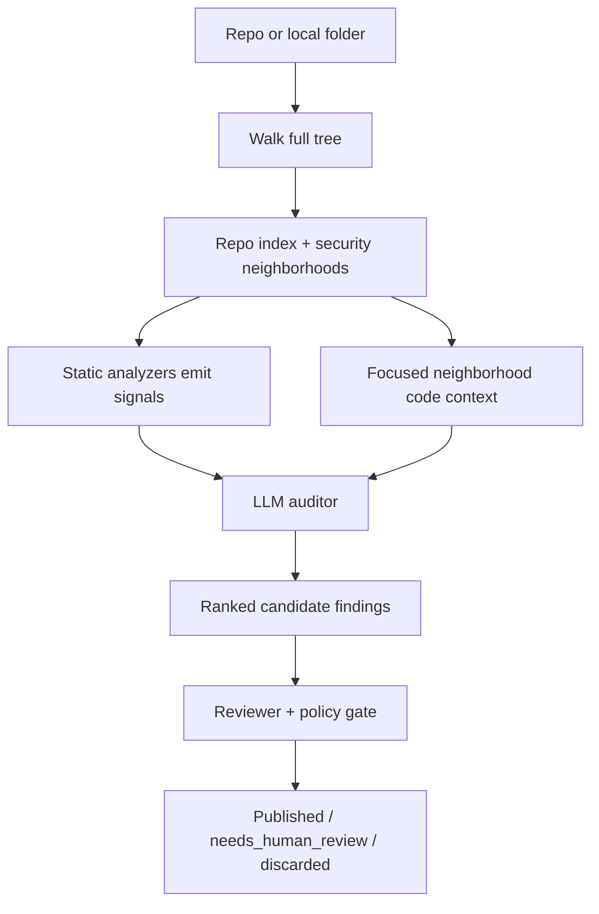
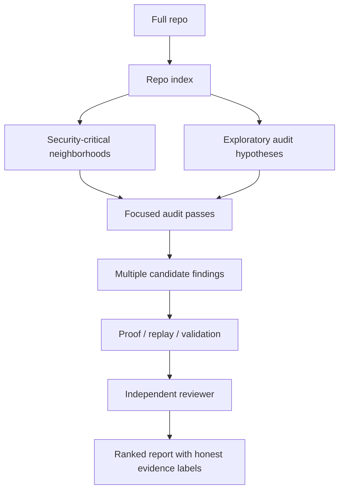

## Vigilance-OS Deep Auditor Pivot

Status: Source of truth for the audit-engine pivot after validating the current MVP

Read this after `PROJECT_SCOPE.md` and alongside `HANDOFF.md`.

This document exists because the current audit engine is real enough to demo honestly, but it is not yet the deep repo auditor the product actually wants to become.

The goal of this pivot is not to discard the current system.

The goal is to preserve the parts that are already strong:

- intake and approval flow
- job lifecycle and queueing
- reviewer gate
- readiness and operator surfaces
- category-specific audit scaffolding

and replace the parts that currently cap audit depth:

- flat selected-file context
- analyzer-dominant discovery
- one-finding-only audit output
- optimistic proof labels

## 1. The Real Answer

We can build the true deep auditor.

The reason it does not exist yet is not that it is impossible.

The reason is that a real deep auditor is a larger system than the current implementation:

- repo indexing
- security-focused retrieval
- multi-hypothesis generation
- per-hypothesis audit passes
- finding dedupe and ranking
- target-specific proof generation
- verification and stronger review independence

The current engine is an intermediate architecture, not the final one.

## 2. Current Architecture

Today the audit engine behaves like this:

### What this means in practice

- The system does inspect the real repo.
- The model does read real code from focused neighborhoods.
- The model still does not reason over the full repo as a connected system.
- The engine now also runs an exploratory neighborhood pass from the repo index, so analyzers no longer fully define the search space.
- A missed file or missed signal can become a missed finding.
- We now preserve multiple candidate findings and track whether they came from analyzers, exploration, or both.
- Proof labels are now more honest, and replay artifacts are now repo-anchored guided harnesses, but they are still not validated or executed proof.

## 3. Why The Current Version Was Built This Way

The current design was trying to optimize for:

- groundedness over pure LLM guessing
- cost and latency control
- predictable demo behavior
- reviewer strictness on high-severity outputs

Those are real advantages.

But the tradeoff is now too visible:

- coverage is too narrow
- discovery is too analyzer-led
- the model is too constrained
- the output is too single-finding-oriented

For the product vision, that tradeoff is no longer good enough.

## 4. Where We Actually Are

The current engine should be described honestly as:

"A grounded, category-aware audit pipeline that combines repo ingestion, repo indexing, security-neighborhood retrieval, analyzer and exploratory candidate seeding, multi-candidate LLM synthesis, and review gating."

It should not be described as:

"A full deep autonomous repo auditor."

## 5. Where We Want To Be

The target architecture should look like this:

### The important difference

The target system does not mean "dump the whole repo into one giant prompt."

It means:

- understand the whole repo
- choose the important parts intelligently
- expand around those parts
- audit multiple hypotheses
- preserve and rank multiple findings
- verify evidence honestly

## 6. Deep Auditor Principles

The pivot should follow these rules:

1. Whole-repo awareness before narrow reasoning
2. Focused retrieval instead of flat file slicing
3. Multiple findings instead of one report
4. Analyzers as helpers, not bosses
5. Reviewer independence must increase, not decrease
6. Proof labels must reflect actual verification status
7. The system must stay defendable if judges read the repo

## 7. What We Keep

Keep these systems and build on them:

- `src/pipeline/jobStore.ts`
- `src/plugins/plugin-ui-bridge/index.ts`
- `src/plugins/plugin-hitl/index.ts`
- `src/plugins/plugin-scout/index.ts`
- readiness and operator-facing status surfacing
- UI queueing, findings, and review lane separation
- Telegram operator flow

These are already useful product assets.

## 8. What Must Change

These are the architectural changes that matter most:

### A. Replace flat capped file selection with repo indexing

The new auditor should build an index of:

- important files
- contracts / programs / modules
- account structs / storage-bearing types
- imports and dependencies
- functions and instructions
- auth-like modifiers / constraints / guards
- external interaction surfaces

### B. Introduce security neighborhoods

Instead of one flat context bundle, create audit neighborhoods such as:

- vaults / pools / staking / lending
- admin / ownership / upgrade / pause
- price and oracle logic
- token transfer and accounting paths
- Solana instructions and their `Accounts` structs
- PDA derivation helpers
- CPI call sites and target program handling

### C. Move from one finding to many candidate findings

The auditor should generate a candidate set, not a single report.

That set should then be:

- deduped
- ranked
- reviewed individually
- retained even when not publishable yet

### D. Add exploratory discovery outside analyzer hits

The model should be allowed to inspect the repo index and propose:

- suspicious subsystems
- missing auth boundaries
- dangerous state transitions
- suspicious external call surfaces

even when no deterministic analyzer signal fired first.

### E. Make proof labels honest

Do not label a template as `runnable_poc`.

Proof should be separated into states like:

- `template_only`
- `guided_replay`
- `validated_replay`
- `executed_poc`

The current guided-replay generators now resolve real files, source symbols, contract/program names, and account or function surfaces from the repo index. That is a meaningful credibility jump, but it still stops short of validation or execution.

### F. Strengthen reviewer independence

The reviewer should not simply inherit the auditor's framing.

It should actively look for:

- real guards the auditor missed
- library / framework semantics that invalidate the claim
- whether the exploit path is reachable
- whether severity is overstated

The current pivot now includes:

- a counter-evidence-first review pass
- focused review neighborhoods instead of the full flat context bundle
- deterministic detection of common framework protections
- policy hooks that can override an overconfident publish verdict when blocking protections are found

## 9. Submission-Day Truth After The Pivot

If the pivot is implemented well enough, the honest demo claim becomes:

"Vigilance-OS indexes a target repo, focuses on the most security-critical code neighborhoods, produces multiple candidate findings, and uses a strict reviewer plus evidence policy to keep the output believable."

That is much stronger and more defendable than the current single-finding analyzer-led framing.

## 10. What We Are Not Trying To Do Right Now

Do not overextend into:

- perfect whole-program formal reasoning
- dynamic live website exploitation
- universal exploit execution across every repo type
- full private-repo auth productization before the engine is stronger

The point is to become deeply credible on the repo-audit wedge first.

## 11. Recommended Build Strategy

Build this pivot in stages:

1. Fix target ingestion reliability
2. Build repo indexing and neighborhood retrieval
3. Change audit output from one finding to many candidate findings
4. Add exploratory model-led discovery beyond analyzer hits
5. Make proof labels honest
6. Improve reviewer independence
7. Add stronger proof generation and validation

## 12. Success Criteria

The pivot is successful when:

- the auditor is no longer limited to one finding
- findings can emerge from repo neighborhoods, not only analyzer hits
- the model sees targeted code neighborhoods chosen from repo-wide awareness
- evidence labels are honest
- reviewer filtering meaningfully reduces false positives
- judges can read the repo and see a real path toward a startup-grade auditing system
