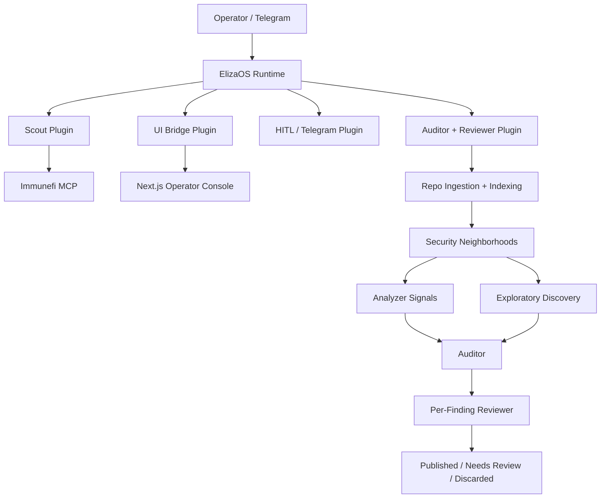

# Vigilance-OS

Vigilance-OS is an evidence-first security agent workflow for auditing blockchain repositories and related protocol codebases.

It combines:

- Scout discovery over Immunefi scope
- explicit human approval before deeper audits
- a repo-indexed auditor that produces multiple findings
- a reviewer that tries to debunk weak claims
- a web console and Telegram control surface for operators

This project is built for the **Nosana x ElizaOS Agent Challenge**, but it is intentionally scoped as the foundation of a real security workflow rather than a one-off demo.

## What It Does

Vigilance-OS supports two main ways of working:

1. **Direct target intake**
   Queue a GitHub repository, a local folder path, or a folder uploaded from the browser.
2. **Scout-driven discovery**
   Discover Immunefi projects, inspect their scoped child targets, and queue one, many, or all relevant children for review.

The golden path is:

1. Submit a target
2. Approve it through the HITL gate
3. Run the audit
4. Run the reviewer
5. Inspect ranked findings with honest evidence labels

## Why This Is Different

Vigilance-OS is not presented as a magical full autonomous auditor that reads an entire repo in one prompt. Instead, it uses a more defensible architecture:

- repo indexing to identify important code and security neighborhoods
- deterministic analyzers for grounded signals
- exploratory model-led discovery beyond analyzer hits
- multi-finding review instead of a single polished guess
- evidence labels that distinguish template guidance from stronger replayable proof

That tradeoff matters because it makes the output easier to defend to judges, technical users, and future product users.

## Architecture



## Where ElizaOS Fits

ElizaOS is not just a thin wrapper here. It is the runtime that holds the system together.

Vigilance-OS uses ElizaOS for:

- agent runtime boot and lifecycle
- character-driven roles for Scout, Auditor, and Reviewer
- plugin composition and tool wiring
- Telegram controls and notifications
- UI bridge routing into the runtime
- OpenAI-compatible model access
- MCP integration for Immunefi discovery

Key runtime entrypoint:

- [scripts/run-eliza.mjs](/C:/VigilanceOS/scripts/run-eliza.mjs)

Key Eliza-facing plugins:

- [src/plugins/plugin-scout/index.ts](/C:/VigilanceOS/src/plugins/plugin-scout/index.ts)
- [src/plugins/plugin-hitl/index.ts](/C:/VigilanceOS/src/plugins/plugin-hitl/index.ts)
- [src/plugins/plugin-auditor-reviewer/index.ts](/C:/VigilanceOS/src/plugins/plugin-auditor-reviewer/index.ts)
- [src/plugins/plugin-ui-bridge/index.ts](/C:/VigilanceOS/src/plugins/plugin-ui-bridge/index.ts)

The domain-specific security engine lives inside that runtime in:

- [src/pipeline](/C:/VigilanceOS/src/pipeline)
- [src/analyzers](/C:/VigilanceOS/src/analyzers)
- [src/scout](/C:/VigilanceOS/src/scout)

## Current Audit Engine

The current auditor is a **repo-indexed, multi-finding auditor**.

At a high level it:

1. Materializes the target
2. Indexes the repository structure
3. Builds security-relevant neighborhoods
4. Seeds findings from analyzers and exploratory model passes
5. Reviews findings individually
6. Ranks and exposes all findings in the UI

Important current behavior:

- findings are no longer collapsed to one hidden primary-only result
- every finding can carry its own review outcome
- the UI shows all reviewed findings
- evidence labels are honest:
  - `template_only`
  - `guided_replay`
  - `validated_replay`
  - `executed_poc`

## Feature Summary

- Direct GitHub repo intake
- Local absolute-path intake for same-machine operation
- Browser folder upload for hosted or remote operation
- Project-level Immunefi Scout discovery
- Child-target fan-out under each Scout project
- Queue one, selected, or all queueable Scout children
- Telegram approval and status workflow
- Multi-finding audit output
- Reviewer pass per finding
- Archive flow for completed jobs
- Readiness cards for model, Scout, and Telegram status

## Quick Start

### 1. Install dependencies

```powershell
npm run install:all
```

### 2. Create your environment file

Copy [`.env.example`](/C:/VigilanceOS/.env.example) to `.env` and fill in the values you need.

Important variables:

- `OPENAI_API_URL`
- `OPENAI_API_KEY`
- `MODEL_NAME`
- `OPENAI_EMBEDDING_URL`
- `OPENAI_EMBEDDING_API_KEY`
- `OPENAI_EMBEDDING_MODEL`
- `OPENAI_EMBEDDING_DIMENSIONS`
- `TELEGRAM_BOT_TOKEN`
- `TELEGRAM_ALERT_CHAT_ID`
- `IMMUNEFI_PYTHON_CMD`
- `SERVER_PORT`

### 3. Start the full local stack

```powershell
npm run dev
```

That starts:

- ElizaOS backend on `http://127.0.0.1:3001`
- Next.js UI on `http://127.0.0.1:4001`

Useful commands:

```powershell
npm run stop
npm run build
npm run build:ui
npm run build:all
```

## Usage

### Direct Target Intake

The operator console supports:

- `GitHub Repo`
- `Local Folder`
- `Immunefi Project`

For direct auditing, the strongest paths are:

- a public GitHub repo URL such as `https://github.com/theredguild/damn-vulnerable-defi`
- a plain `owner/repo` value such as `theredguild/damn-vulnerable-defi`
- a local absolute folder path when the backend runs on the same machine
- a folder upload when the backend is hosted somewhere else

### Scout Workflow

Scout now works at the **project** level instead of flattening each Immunefi discovery into one fake job.

The flow is:

1. Scout discovers a project
2. The UI shows that project with scoped child targets underneath it
3. The operator queues one child, selected children, or all queueable children
4. Only then are real audit jobs created

This keeps discovery separate from execution and avoids queue spam.

### Telegram Workflow

Telegram is a real operator surface, not just a notification stub.

Supported commands:

- `/approve <jobId>`
- `/status <jobId>`
- `/report <jobId>`
- `/findings`
- `/scope <projectRef>`
- `/queue <projectRef> <childRef[,childRef...]>`
- `/queueall <projectRef>`

Automatic alerts include:

- Scout project discovery alerts
- manual target approval requests
- audit completion summaries

## Demo Targets

The controlled demo targets used during development are:

- EVM: [theredguild/damn-vulnerable-defi](https://github.com/theredguild/damn-vulnerable-defi)
- Solana: [coral-xyz/sealevel-attacks](https://github.com/coral-xyz/sealevel-attacks)

For demo recording, the recommended hero path is:

1. submit a direct GitHub target
2. approve it in UI or Telegram
3. open the reviewed findings in the UI

Scout is best shown as a secondary discovery surface.

## Nosana Integration

Vigilance-OS is designed to run with Nosana-hosted models and can also point at a self-hosted Nosana vLLM deployment.

Current usage patterns:

- hosted OpenAI-compatible Nosana endpoint for the main audit model
- hosted Nosana embedding endpoint for Eliza memory and semantic retrieval support
- optional self-hosted vLLM deployment for `Qwen3.5-27B-AWQ-4bit`

Self-hosting runbook:

- [nos_job_def/SELF_HOST_MODEL_RUNBOOK.md](/C:/VigilanceOS/nos_job_def/SELF_HOST_MODEL_RUNBOOK.md)

## Readiness Model

The UI exposes live readiness states so operators can tell whether the system is genuinely usable before starting a run.

Readiness covers:

- Scout / Immunefi MCP
- OpenAI-compatible model endpoint
- Telegram

Relevant files:

- [src/readiness.ts](/C:/VigilanceOS/src/readiness.ts)
- [src/plugins/plugin-ui-bridge/index.ts](/C:/VigilanceOS/src/plugins/plugin-ui-bridge/index.ts)

## Project Structure

```text
characters/                 ElizaOS character definitions
src/analyzers/              EVM, Solana, and guided replay analyzers
src/pipeline/               Ingestion, indexing, audit, review, job store
src/plugins/                ElizaOS runtime plugins
src/scout/                  Scout watcher and project discovery logic
src/telegram/               Telegram alert helpers
ui/                         Next.js operator console
nos_job_def/                Nosana model deployment assets and runbook
scripts/                    Stack orchestration and startup scripts
```

## Verified State

The following commands have been used repeatedly during development to verify the current codebase:

```powershell
bunx tsc -p tsconfig.json
bun run build
bun run build:ui
```

The local stack is run with:

```powershell
powershell.exe -ExecutionPolicy Bypass -File .\scripts\run-stack.ps1 -Mode dev
```

## Known Limitations

Vigilance-OS is intentionally honest about current limits.

- Solana coverage is improving but still narrower than EVM coverage
- Scout fan-out is currently strongest for repo-like child targets
- explorer, docs, and web scope entries are preserved as context, but not all of them are queueable yet
- findings are evidence-ranked, but not every finding has validated or executed proof
- dynamic live web testing is not part of this submission version

## Key Product Docs

These files are the best way to understand scope, current state, and continuation plans:

- [PROJECT_SCOPE.md](/C:/VigilanceOS/PROJECT_SCOPE.md)
- [HANDOFF.md](/C:/VigilanceOS/HANDOFF.md)
- [DEEP_AUDITOR_PIVOT.md](/C:/VigilanceOS/DEEP_AUDITOR_PIVOT.md)
- [DEEP_AUDITOR_CHECKLIST.md](/C:/VigilanceOS/DEEP_AUDITOR_CHECKLIST.md)

## Submission Positioning

The most accurate way to describe this project in a demo or judging context is:

> Vigilance-OS is an ElizaOS-powered security agent workflow that discovers protocol targets, lets an operator approve them, performs repo-indexed multi-finding audits, runs a reviewer pass per finding, and presents the results with honest evidence labels through a web console and Telegram.

That is a much stronger and more defensible claim than pretending the system is a magical full-repo autonomous auditor with perfect exploit proof on every run.

## License

This repository currently follows the challenge repository structure and does not yet define a separate project license.
